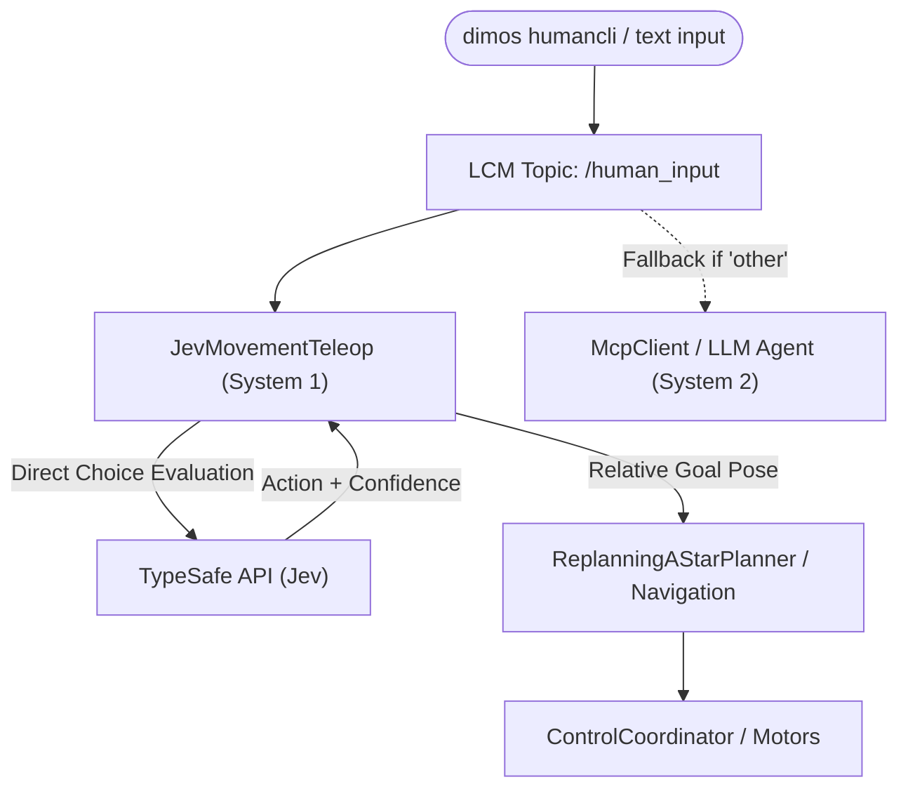

# Unitree Go2 Text Command Teleop with TypeSafe Jev

A guide to using low-latency, "System 1" natural language directional control for the Unitree Go2 (both in simulation and on real hardware) powered by TypeSafe's Jev classifier.

---

## 1. Overview: Why Jev?

In standard DimOS agentic blueprints (such as `unitree-go2-agentic`), natural language text commands are processed through a full LLM reasoning loop (`McpClient` → LLM tool-calling → `McpServer` → `UnitreeSkillContainer`). While powerful for open-ended queries, this introduces a **2–5+ second latency round-trip** for simple, immediate commands like *"move forward 1 meter"* or *"stop"*.

`JevMovementTeleop` solves this by introducing a fast **System 1 reflex path**:
- It uses TypeSafe's Jev (`typesafe-sdk`) to evaluate incoming text commands via high-speed classification rather than autoregressive reasoning.
- Simple directional instructions are parsed, converted into relative goal poses, and dispatched directly to the robot's navigation stack in **under a second**.
- If a command is complex, ambiguous, or classified as `"other"`, Jev steps aside, allowing a co-running LLM (`McpClient`) to handle the instruction as a fallback.



---

## 2. Architecture & Components

### 2.1 The `JevMovementTeleop` Module
Located at [`dimos/robot/unitree/jev_movement_teleop.py`](file:///Users/faizfirdaus/dimos-app/dimos-app/dimos/dimos/robot/unitree/jev_movement_teleop.py).

- **Input Stream**: Subscribes to `human_input: In[str]`, the stream fed by `dimos humancli` or web text inputs.
- **Output Stream**: Publishes conversational feedback to `agent: Out[BaseMessage]`.
- **Classification Categories**:
  - `forward`: Move straight ahead in current heading.
  - `backward`: Move straight backward.
  - `strafe_left`: Move sideways to the robot's left without turning.
  - `strafe_right`: Move sideways to the robot's right without turning.
  - `turn_left`: Rotate in place counter-clockwise.
  - `turn_right`: Rotate in place clockwise.
  - `stop`: Immediately cancel active navigation goals.
  - `other`: Non-directional commands (forwarded to full LLM if present).
- **Magnitude Extraction**:
  - Automatically parses numeric values with optional units (e.g., `1.5`, `2m`, `50cm`).
  - Supports natural spelled-out numbers (e.g., `"half a meter"`, `"ninety degrees"`, `"two meters"`).
  - Defaults to `0.5m` for translation and `30°` for rotation if no magnitude is specified.
- **Goal Calculation**: Queries `tfbuffer.get("world", "base_link")` to transform relative deltas into absolute `PoseStamped` world coordinates and calls `_navigation.set_goal()`.

---

## 3. Available Blueprints

### Blueprint A: `unitree-go2-jev-movement` (Pure Jev, Zero LLM)
- **Path**: [`dimos/robot/unitree/go2/blueprints/smart/unitree_go2_jev_movement.py`](file:///Users/faizfirdaus/dimos-app/dimos-app/dimos/dimos/robot/unitree/go2/blueprints/smart/unitree_go2_jev_movement.py)
- **Use Case**: Fast text teleoperation without requiring an OpenAI key, local Ollama instance, or Hugging Face setup.
- **Components**: Base `unitree_go2` stack + `JevMovementTeleop`.

### Blueprint B: `unitree-go2-agentic-movement` (Lightweight LLM Agent)
- **Path**: [`dimos/robot/unitree/go2/blueprints/agentic/unitree_go2_agentic_movement.py`](file:///Users/faizfirdaus/dimos-app/dimos-app/dimos/dimos/robot/unitree/go2/blueprints/agentic/unitree_go2_agentic_movement.py)
- **Use Case**: Full agentic tool-calling for general queries, stripped of heavy dependencies like Git LFS CLIP downloads (`SpatialMemory`) and Qwen VL models (`PersonFollowSkillContainer`).

---

## 4. Setup & Prerequisites

### 4.1 Set API Credentials
`JevMovementTeleop` checks for either `TYPESAFE_API_KEY` or `JEV_KEY`:

```bash
export TYPESAFE_API_KEY="your-typesafe-api-key"
# or add to .env:
# TYPESAFE_API_KEY=your-typesafe-api-key
```

### 4.2 Install Dependencies
Ensure `typesafe-sdk` is installed (it is declared under `agents` in `pyproject.toml`):

```bash
uv pip install "typesafe-sdk>=0.5,<1"
```

---

## 5. How to Run and Use

### Step 1: Launch the Robot Stack

#### In Simulation (MuJoCo):
```bash
dimos --simulation run unitree-go2-jev-movement
```

#### On Real Hardware:
```bash
dimos run unitree-go2-jev-movement --robot-ip 192.168.123.161
```

### Step 2: Open the Text Operator Interface
In a separate terminal, launch the interactive text CLI:

```bash
dimos humancli
```

### Step 3: Issue Natural Language Movement Commands
Type commands directly into the prompt:

| Command | Action Executed |
|---|---|
| `move forward 1 meter` / `forward 1m` | Moves forward 1.0 m |
| `back up half a meter` / `step back` | Moves backward 0.5 m |
| `strafe left 50cm` / `slide left` | Sidesteps left 0.5 m |
| `turn right 90 degrees` / `turn right` | Rotates clockwise by 90° (or default 30°) |
| `turn left forty-five degrees` | Rotates counter-clockwise by 45° |
| `stop` / `halt` / `freeze` | Cancels active navigation goal immediately |

---

## 6. How Fallback Handling Works

When running alongside an LLM agent:
1. When you enter a command, both `JevMovementTeleop` and `McpClient` receive the string via `/human_input`.
2. If Jev identifies a directional action with confidence $\ge 0.6$, it executes the move immediately and publishes an acknowledgment (e.g. `Forward (1m).`).
3. If the command is not a simple directional instruction (e.g., *"What do you see?"*, *"Where is the kitchen?"*), Jev outputs `action: other` and silently yields execution to the LLM agent.
