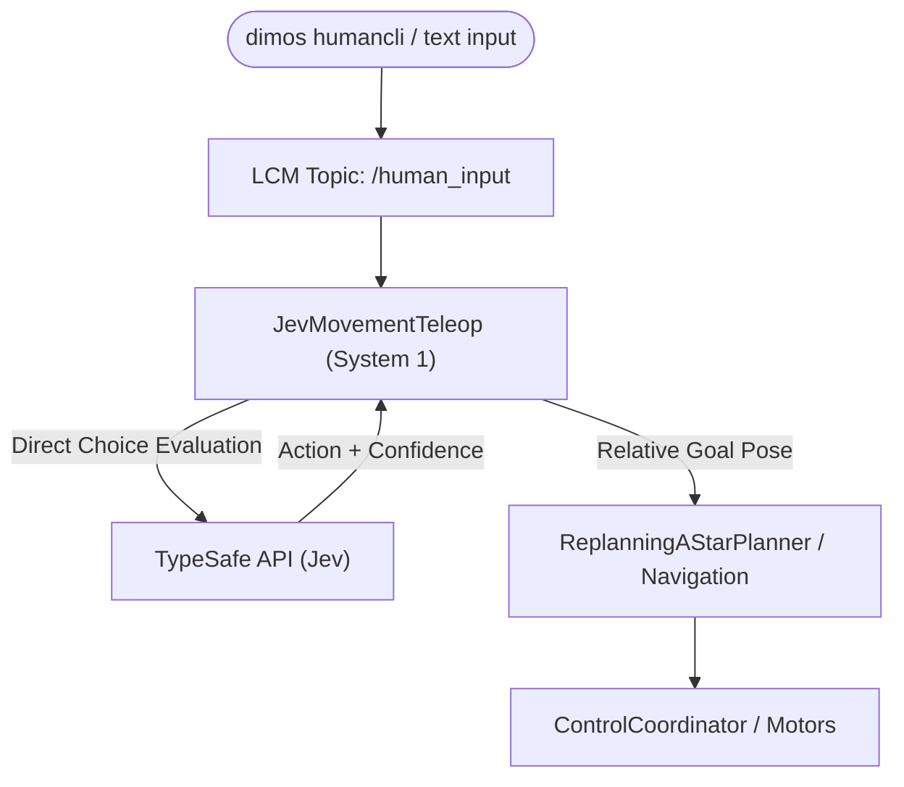

# Unitree Go2 Text Command Teleop with TypeSafe Jev

A guide to using low-latency, "System 1" natural language directional control for the Unitree Go2 (both in simulation and on real hardware) powered by TypeSafe's Jev classifier.

---

## 1. Overview: Why Jev?

In standard DimOS agentic blueprints (such as `unitree-go2-agentic`), natural language text commands are processed through a full LLM reasoning loop (`McpClient` → LLM tool-calling → `McpServer` → `UnitreeSkillContainer`). While powerful for open-ended queries, this introduces a **2–5+ second latency round-trip** for simple, immediate commands like *"move forward 1 meter"* or *"stop"*.

`JevMovementTeleop` solves this by introducing a fast **System 1 reflex path**:
- It uses TypeSafe's Jev (`typesafe-sdk`) to evaluate incoming text commands via high-speed classification rather than autoregressive reasoning.
- Simple directional instructions are parsed, converted into relative goal poses, and dispatched directly to the robot's navigation stack in **under a second**.
- Complex, ambiguous, or rejected commands must not execute. Use the pure-JEV blueprint; a shared input topic does not provide arbitration with an LLM subscriber.



---

## 2. Architecture & Components

### 2.1 The `JevMovementTeleop` Module
Located at [`dimos/robot/unitree/jev_movement_teleop.py`](file:///Users/faizfirdaus/dimos-app/dimos-app/dimos/dimos/robot/unitree/jev_movement_teleop.py).

- **Input Stream**: Subscribes to `human_input: In[str]`, the stream fed by `dimos humancli` or web text inputs.
- **Output Stream**: Publishes conversational feedback to `agent: Out[BaseMessage]`.
- **Classification Categories**:
  - `forward`: Move straight ahead in current heading.
  - `backward`: Move straight backward.
  - `strafe_left`: Move sideways to the robot's left without turning.
  - `strafe_right`: Move sideways to the robot's right without turning.
  - `turn_left`: Rotate in place counter-clockwise.
  - `turn_right`: Rotate in place clockwise.
  - `stop`: Immediately cancel active navigation goals.
  - `other`: Non-directional commands (forwarded to full LLM if present).
- **Magnitude Extraction**:
  - Automatically parses numeric values with optional units (e.g., `1.5`, `2m`, `50cm`).
  - Supports natural spelled-out numbers (e.g., `"half a meter"`, `"ninety degrees"`, `"two meters"`).
  - Defaults to `0.5m` for translation and `30°` for rotation if no magnitude is specified.
- **Goal Calculation**: Queries `tfbuffer.get("world", "base_link")` to transform relative deltas into absolute `PoseStamped` world coordinates and calls `_navigation.set_goal()`.

---

## 3. Available Blueprints

### Blueprint A: `unitree-go2-jev-movement` (Pure Jev, Zero LLM)
- **Path**: [`dimos/robot/unitree/go2/blueprints/smart/unitree_go2_jev_movement.py`](file:///Users/faizfirdaus/dimos-app/dimos-app/dimos/dimos/robot/unitree/go2/blueprints/smart/unitree_go2_jev_movement.py)
- **Use Case**: Fast text teleoperation without requiring an OpenAI key, local Ollama instance, or Hugging Face setup.
- **Components**: Base `unitree_go2` stack + `JevMovementTeleop`.

### Blueprint B: `unitree-go2-agentic-movement` (Lightweight LLM Agent)
- **Path**: [`dimos/robot/unitree/go2/blueprints/agentic/unitree_go2_agentic_movement.py`](file:///Users/faizfirdaus/dimos-app/dimos-app/dimos/dimos/robot/unitree/go2/blueprints/agentic/unitree_go2_agentic_movement.py)
- **Use Case**: Full agentic tool-calling for general queries, stripped of heavy dependencies like Git LFS CLIP downloads (`SpatialMemory`) and Qwen VL models (`PersonFollowSkillContainer`).

---

## 4. Setup & Prerequisites

### 4.1 Set API Credentials
`JevMovementTeleop` checks for either `TYPESAFE_API_KEY` or `JEV_KEY`:

```bash
export TYPESAFE_API_KEY="your-typesafe-api-key"
# or add to .env:
# TYPESAFE_API_KEY=your-typesafe-api-key
```

### 4.2 Install Dependencies
Install this repository's routing package in the environment running the integration:

```bash
python -m pip install -e .
```

---

## 5. How to Run and Use

### Step 1: Launch the Robot Stack

#### In Simulation (MuJoCo):
```bash
dimos --simulation run unitree-go2-jev-movement
```

#### On Real Hardware:
```bash
dimos run unitree-go2-jev-movement --robot-ip 192.168.123.161
```

### Step 2: Open the Text Operator Interface
In a separate terminal, launch the interactive text CLI:

```bash
dimos humancli
```

### Step 3: Issue Natural Language Movement Commands
Type commands directly into the prompt:

| Command | Action Executed |
|---|---|
| `move forward 1 meter` / `forward 1m` | Moves forward 1.0 m |
| `back up half a meter` / `step back` | Moves backward 0.5 m |
| `strafe left 50cm` / `slide left` | Sidesteps left 0.5 m |
| `turn right 90 degrees` / `turn right` | Rotates clockwise by 90° (or default 30°) |
| `turn left forty-five degrees` | Rotates counter-clockwise by 45° |
| `stop` / `halt` / `freeze` | Cancels active navigation goal immediately |

---

## 6. Execution Isolation

Run the pure-JEV blueprint for voice commands. Do not attach a second movement-capable LLM subscriber to `/human_input`: both subscribers would receive the same command, and a JEV acknowledgment does not suppress the other subscriber. There is no implemented fallback arbitration.

Navigation goal cancellation is not a verified physical emergency stop. Keep an independent local stop available. Validate dry-run, replay, and simulation before any hardware use.

## 7. Deepgram Voice Setup

Use a project virtual environment to avoid changing packages used by other applications. In PowerShell:

```powershell
python -m venv .venv
.\.venv\Scripts\python -m pip install -e ".[voice]"
```

On Linux/WSL:

```bash
python -m venv .venv
.venv/bin/python -m pip install -e ".[voice]"
```

Set `DEEPGRAM_API_KEY` in your process environment. Set `TYPESAFE_API_KEY` as well when enabling JEV routing. `.env.example` is a template only; the voice CLI does not automatically load `.env`. Do not put credentials in source files or committed shell scripts.

The voice path uses Deepgram Flux, PCM16 mono audio at 16 kHz, and finalized turns only. No speech output or conversational LLM is involved. Default operation is dry-run; partial transcripts must never become movement commands.

From the activated project environment:

```bash
steve-voice --help
steve-voice
steve-voice --route
```

The console uses Enter to start recording and Enter again to release; this is a toggle, not a physical hold-to-talk button. The default command prints the finalized transcript. `--route` additionally sends it to JEV and prints a validated decision; it does not send movement to dimOS. Neither command is a robot emergency stop. Microphone capture transmits audio to Deepgram only when deliberately started.

Offline verification requires no microphone, API credentials, or robot:

```bash
python -m unittest discover -s tests -v
```

WSLg microphone input depends on the host audio configuration. Probe available devices before assuming it works; use native Windows capture if WSLg input is unavailable. Linux capture may require the system PortAudio package.

This repository contains dimOS patch files, not a complete dimOS installation. Installing this Python package does not copy patches into `/home/ekagr/dimos`, register blueprints there, or enable hardware control.
