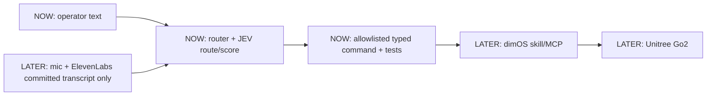

# voice-to-Go2 (HackMIT)

Text-routed control for a Unitree Go2 running Dimensional OS (dimOS): operator text goes through TypeSafe AI JEV into allowlisted typed commands; microphone/voice input comes later.

## Status / current phase

- Phase 1 router implemented in `steve_router/` (`commands.py`, `router.py`, `cli.py`) with pure tests in `tests/test_router.py`. Not yet dimOS-actuating: `to_motion()` returns `(lx, ly, az)` tuples but nothing publishes to dimOS/Go2.
- Phase 1 (current): JEV text-to-typed-command routing. Plain text in, allowlisted typed command out.
- Deferred: ElevenLabs and microphone voice control. No STT, audio, or mic code in Phase 1.

## Architecture

Target: `mic -> ElevenLabs committed transcript ONLY -> JEV typed route/score -> allowlisted command -> dimOS skill/MCP -> Unitree Go2`.



Notes:

- `NOW` boxes exist as code (`steve_router/commands.py`, `steve_router/router.py`, `tests/`). `LATER` boxes are not started.
- Voice path is committed transcript events only; partial transcripts never route or actuate.
- Incoming `dimos/robot/unitree/keyboard_teleop.py` is a reference patch for teleop semantics (motion signs/bounds); it is not the installed dimOS checkout.

## Why JEV

- JEV takes text in and returns typed decisions (choice/score/boolean-style outputs), not prose or audio.
- That fits the router role: map one text input to exactly one allowlisted command (or reject), with a score for thresholding.
- It keeps routing low-latency and constrained to a closed command set, with out-of-set decisions rejected before dimOS/Go2.
- Verified contract (recheck current docs before use): `POST https://api.typesafe.ai/v1/systemone`, model IDs `jev-latest` / `jev-1.13.0`.
- Correct SDKs: `typesafe-sdk` (Python), `@typesafe-ai/sdk` (JS). Do NOT use the generic npm package named `jev`; it is unrelated.

## Milestones (strict order)

1. Command schema / allowlist: closed set of typed commands plus reject path. Done (`steve_router/commands.py`).
2. JEV text routing + pure tests: text input to typed command/score, tested without hardware. Done (`steve_router/router.py`, `tests/test_router.py`).
3. dimOS replay adapter: play routed commands through replay first.
4. Simulation: same commands in simulation before any hardware.
5. ElevenLabs committed-event voice input: mic path added only after routing is solid; committed transcripts only.
6. Hardware last: real Go2 only after replay and simulation pass.

## Safety invariants

- No partial STT actuation: when voice lands later, committed events only, never partials.
- Allowlisted typed commands only: JEV output outside the allowlist is rejected, never forwarded.
- Reject stays silent: ambiguity yields `action=None` (no actuation), never a guessed motion. Explicit stop is an accepted `stop` command.
- Local/physical e-stop independent of cloud APIs and JEV.
- Order is replay -> simulation -> hardware; do not skip steps.
- Keep obstacle avoidance enabled on the Go2.
- Ping <10ms to the robot before any hardware run.

## Setup

```sh
python -m venv .venv
.venv/Scripts/activate  # Windows; on POSIX use: source .venv/bin/activate
pip install -e .
```

`.env.example` is a template only; this project does not load dotenv files. Export `TYPESAFE_API_KEY` into the process environment (POSIX/WSL: `export TYPESAFE_API_KEY=...`; PowerShell: `$env:TYPESAFE_API_KEY="..."`).

Upstream dimOS references only (verify against current official docs before use):

- Installer: official dimOS quickstart ships `install.sh`; see `https://docs.dimensional.org/quickstart/`.
- WSL note (observed in this project): install dimOS inside the Linux home directory (for example `~/dimos`), not under `/mnt/d`, to avoid chmod failures on the Windows mount.
- Verified upstream run commands (flags may change; check docs):

  ```sh
  dimos --replay run unitree-go2
  dimos --simulation run unitree-go2
  dimos run unitree-go2
  ```

  The last command targets real hardware and needs `ROBOT_IP` set. Hardware is out of scope until replay and simulation pass.

## CLI

```sh
steve-route "move forward"
steve-route move forward quickly --confidence-threshold 0.8 --model jev-latest
```

Prints one JSON object with `accepted`, `action`, `speed_mode`, `confidence`, `reason`, `source_text`, and `motion` (`[lx, ly, az]` or `null`). Requires `TYPESAFE_API_KEY` in the environment. SDK auth/network errors are not hidden; they propagate.

## Tests

```sh
python -m unittest discover -s tests -v
```

Pure stdlib tests with a fake JEV client: no network, no key, no hardware.

## Environment

- `ROBOT_IP`: verified env name for the Go2 address; required only for hardware runs.
- `ELEVENLABS_API_KEY`: expected for the later voice phase; keep server-side only. Not used in Phase 1.
- `TYPESAFE_API_KEY`: documented TypeSafe SDK key (read from env by `typesafe-sdk`); required for live routing and the CLI.

## Docs

- dimOS quickstart: `https://docs.dimensional.org/quickstart/`
- dimOS Go2 platform: `https://docs.dimensional.org/platforms/quadruped/go2/`
- TypeSafe AI JEV (blog/docs): `https://typesafe.ai/`
- ElevenLabs docs (STT Realtime): `https://elevenlabs.io/docs`
