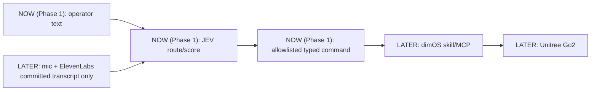

# voice-to-Go2 (HackMIT)

Text-routed control for a Unitree Go2 running Dimensional OS (dimOS): operator text goes through TypeSafe AI JEV into allowlisted typed commands; microphone/voice input comes later.

## Status / current phase

- Architecture planned, no application code yet. This repo tracks only `.gitignore` and `AGENTS.md` plus this README.
- Phase 1 (current): JEV text-to-typed-command routing. Plain text in, allowlisted typed command out.
- Deferred: ElevenLabs and microphone voice control. No STT, audio, or mic code in Phase 1.

## Architecture (planned, nothing implemented)

Eventual target: `mic -> ElevenLabs committed transcript ONLY -> JEV typed route/score -> allowlisted command -> dimOS skill/MCP -> Unitree Go2`.



Notes:

- `NOW` boxes are Phase 1 scope (text routing only). `LATER` boxes are not started.
- Voice path is committed transcript events only; partial transcripts never route or actuate.
- Nothing above is implemented; treat the diagram as the build plan.

## Why JEV

- JEV takes text in and returns typed decisions (choice/score/boolean-style outputs), not prose or audio.
- That fits the router role: map one text input to exactly one allowlisted command (or reject), with a score for thresholding.
- It keeps routing low-latency and constrained to a closed command set, with out-of-set decisions rejected before dimOS/Go2.
- Verified contract (recheck current docs before use): `POST https://api.typesafe.ai/v1/systemone`, model IDs `jev-latest` / `jev-1.13.0`.
- Correct SDKs: `typesafe-sdk` (Python), `@typesafe-ai/sdk` (JS). Do NOT use the generic npm package named `jev`; it is unrelated.

## Milestones (strict order)

1. Command schema / allowlist: closed set of typed commands plus reject path.
2. JEV text routing + pure tests: text input to typed command/score, tested without hardware.
3. dimOS replay adapter: play routed commands through replay first.
4. Simulation: same commands in simulation before any hardware.
5. ElevenLabs committed-event voice input: mic path added only after routing is solid; committed transcripts only.
6. Hardware last: real Go2 only after replay and simulation pass.

## Safety invariants

- No partial STT actuation: when voice lands later, committed events only, never partials.
- Allowlisted typed commands only: JEV output outside the allowlist is rejected, never forwarded.
- Local/physical e-stop independent of cloud APIs and JEV.
- Order is replay -> simulation -> hardware; do not skip steps.
- Keep obstacle avoidance enabled on the Go2.
- Ping <10ms to the robot before any hardware run.

## Setup

No manifest exists in this repo, so there are no project install or test commands to show. Do not invent any.

Upstream dimOS references only (verify against current official docs before use):

- Installer: official dimOS quickstart ships `install.sh`; see `https://docs.dimensional.org/quickstart/`.
- WSL note (observed in this project): install dimOS inside the Linux home directory (for example `~/dimos`), not under `/mnt/d`, to avoid chmod failures on the Windows mount.
- Verified upstream run commands (flags may change; check docs):

  ```sh
  dimos --replay run unitree-go2
  dimos --simulation run unitree-go2
  dimos run unitree-go2
  ```

  The last command targets real hardware and needs `ROBOT_IP` set. Hardware is out of scope until replay and simulation pass.

## Environment

- `ROBOT_IP`: verified env name for the Go2 address; required only for hardware runs.
- `ELEVENLABS_API_KEY`: expected for the later voice phase; keep server-side only. Not used in Phase 1.
- TypeSafe key: the env variable name is unverified. Confirm it from the official TypeSafe docs/SDK before use; do not assume any `TYPESAFE_*` name.

## Docs

- dimOS quickstart: `https://docs.dimensional.org/quickstart/`
- dimOS Go2 platform: `https://docs.dimensional.org/platforms/quadruped/go2/`
- TypeSafe AI JEV (blog/docs): `https://typesafe.ai/`
- ElevenLabs docs (STT Realtime): `https://elevenlabs.io/docs`
